# Byte Bandits CTF

### Team Name: AuthSec 
-----------
 

 

| Members/Writeup Authors     |  |
| -----------  | ----------- |
|Diana Xu|
|Clayton Barbier|
|Eliana Halevi|
|Jen Smith|
      

## CTF Overview
The challenges were jeopardy style, and points started at 500 but dropped as there were more solves. Categories included Blockchain, Rev, Misc, Forensics, Pwn, Crypto, and Web.

| Challenge Name      | Point Value |
| -----------  | ------|
|Welcome to BBCTF|	50|
|Hi-Score	|50|
|Improper Error Handling	|50|
|Survey	|50|
|Meaning of Life	|198|
|Tree of Secrets	|292|
|Random Requests	|333|
|Vastness of Space|	359|
|Imageception|	451|
|TOTAL|	1833|

   
  

# Tree of Secrets 
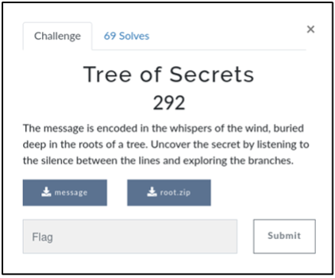

In the “Tree of Secrets” challenge, participants were provided with what appeared to be an encoded message (see Figure 1) along with an archive file (“root.zip”) containing two parent directories (“0” and “1”). Each of the parent folders contained several subdirectories.

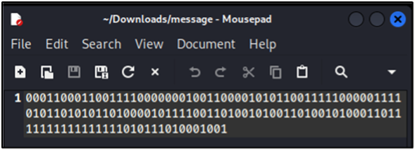
Figure 1 – Encoded message
Upon enumerating the subdirectories, some were observed to contain an empty file named with an individual character (see Figure 2 as an example).

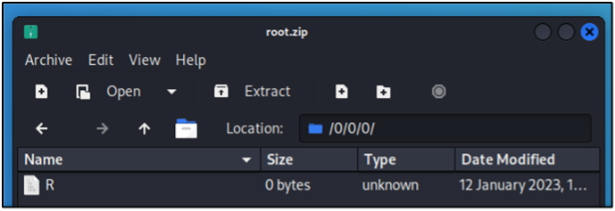
Figure 2 – Empty file named “R”
As depicted under Figure 3 below, the “ls” utility was executed to enumerate the directories recursively to capture all the unique values.

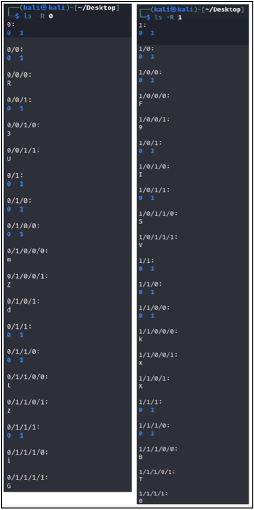
Figure 3 – Identification of directory path and value combinations
Starting from the left side of the provided encoded message, manual matching was performed using the identified directory paths that contained a named file. When a match was found, the file name was noted (e.g., starting from the left, ‘000’ in the encoded message matched the directory path ‘0/0/0’ which contained the file named “R”. See Figure 4 for the manual matching exercise.

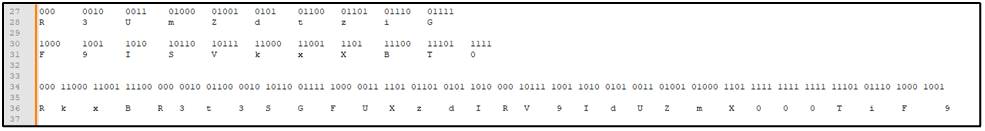
Figure 4 – Manual matching exercise using directory path + file name association to encoded message
The resultant encoded message was “RkxBR3t3SGFUXzdIRV9IdUZmX000TiF9”, which appeared to be base64-encoded. Following through with this assumption, the flag was decoded and revealed (see Figure 5).
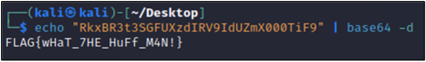
Figure 5 – Base64-decoded message revealed the flag
Python was later used to automate the manual matching exercise noted above. A dictionary was constructed using key:value pairs for the directory paths that contained a name file (e.g., ‘000’: ‘R’ and ‘0010’: ‘3’). The Python code snippet has been provided under Figure 6 below.

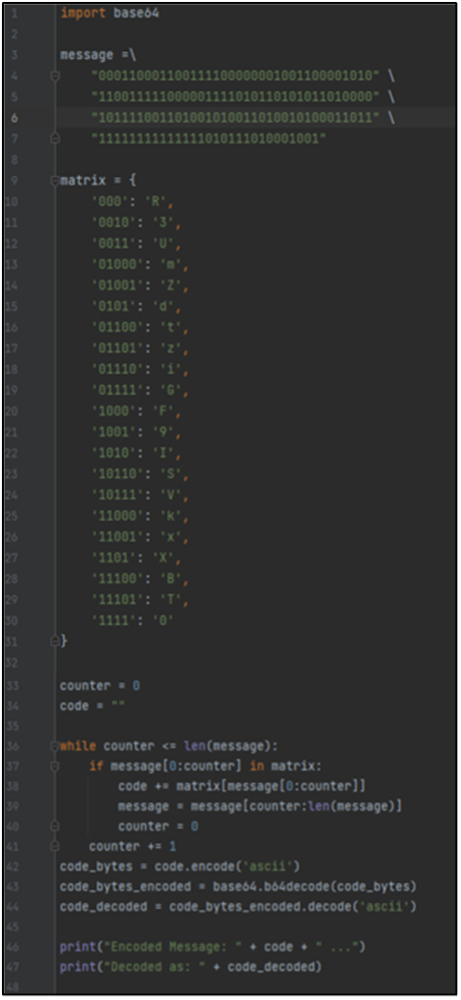
Figure 6 – Python code snippet for matching
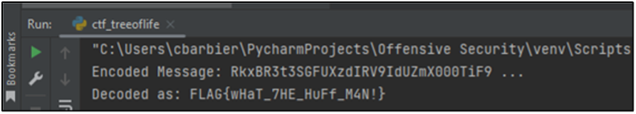

   
  

# Random Requests 
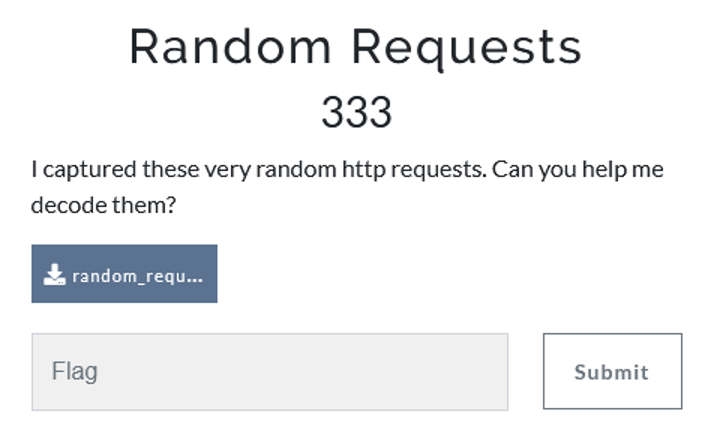
In this challenge we are given a packet capture. After opening this in Wireshark, we can see that there are many GET requests being sent to /flag followed by “=0”, “=1” or ”=%20”. “%20” usually means a space in URL encoding, and with the rest of the options being 0 or 1, this seems likely there is a binary message being hidden in these packets. 
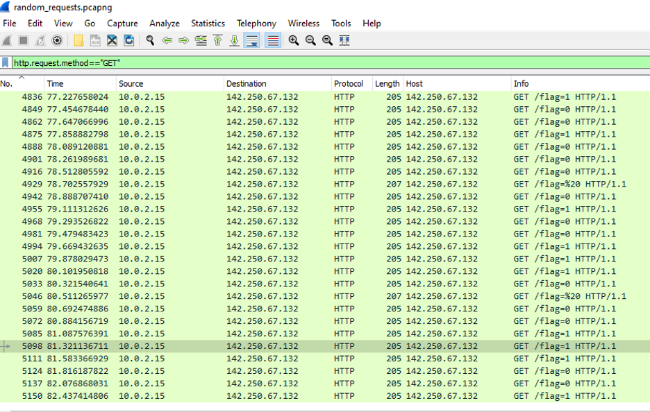
We can filter for just the HTTP GET requests using http.request.method=="GET" and export this to a .csv file. After copying this to a CyberChef and using the binary decoder, we get a code: ZmxhZ3tuT1RfU29fcjRuZG9tX2g3N3BfcjNxdTM1dHN9. Decoding this from Base64 gives us the flag.  
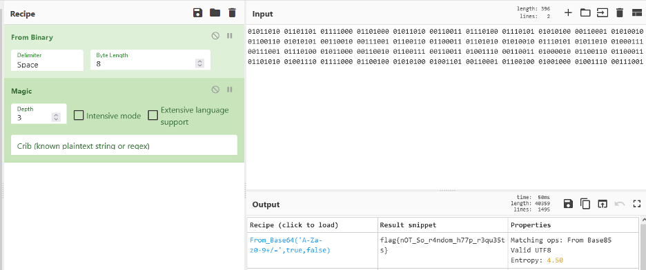
The final flag is: flag{nOT_So_r4ndom_h77p_r3qu35ts}.

   
  

# Vastness of Space 

The prompt for this challenge was a jpeg file called Empty_Space.jpg. Knowing that this was a forensics challenge, I figured I should begin my examination with the metadata! It’s an obvious place to start, but often the clues we need are right under our noses.
 
My hunch was correct! In the metadata I learned that I will need to eventually use “BBCTF” as a password.

From there, I ran 
~~~
strings Empty_Space.jpg > new.txt
~~~
to see if any additional unencrypted data was hiding in plain sight.

 Although the vast majority of the output was encrypted, something caught my attention: right before the output shifts into a small column, there are two nearly identical lines that don’t look random at all. Both begin with &’()*, several numbers, and :CDEFGHIJSTUVWXYZcdefghijstuvwxyz
 
A quick Google showed that often (although not always) these strings are indicative of steganographic tools at play, like steghide. I installed steghide and ran 
~~~
steghide extract -sf Empty_Space.jpg
~~~

A chance to use the password I found! As a result, I extracted a file called somedata.txt

Inside somedata.txt were thousands of rows of two numbers separated by a comma. It was 4 in the morning and I hit a wall. I knew I was close, but what could these numbers mean?

Luckily, my teammate Diana was awake and came to the rescue: coordinates! When plotted (like in python with matplotlib), the coordinates make a QR code!
 

A scan of the QR code gave us the flag! flag{qUiCk_R3sP0nse_c0d3}
 

 

   
  

 
# Imageception
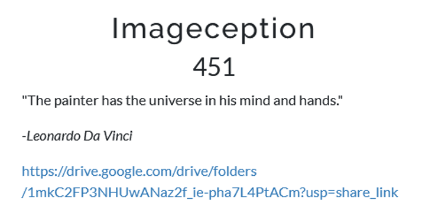
This challenge provides us with a .raw file. This seems to be a capture of the RAM, so let’s use Volatility to see what’s going on. 

First, let’s use vol.py -f imageception.raw windows.pslist.PsList to see the processes that have been captured. Since the name of the challenge is Imageception, I assume there would be an image related process. Sure enough, there is a process for mspaint.exe. 
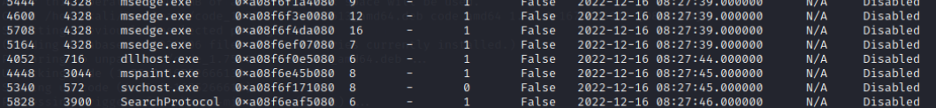

Using vol.py -f imageception.raw windows.cmdline.CmdLine will then give us the name of a file that was used with mspaint: imageception.png. 
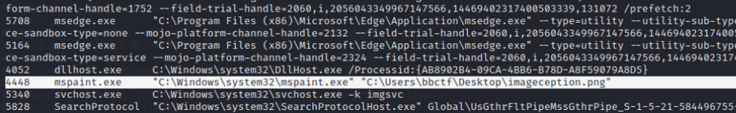

Using vol.py -f imageception.raw windows.filescan.FileScan | grep imageception will then give us two files that contain the name imageception and their offsets. Strangely Volatility3 gave two files, while Volatility2 only gave the .lnk file. The .lnk file did not contain any useful information. 
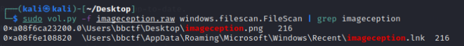

Using the offset of imageception.png file, we can carve out the file with the command: vol.py -f imageception.raw -o outputFolder windows.dumpfiles.DumpFiles --virtaddr 0xa08f6ca23200.  
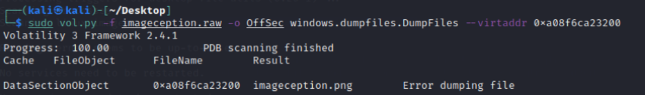

However, there is an error dumping the file, and this produces the .dat file. You could open it in GIMP to get the flag. I used CyberChef to extract the png file.  
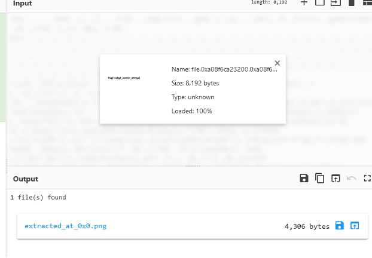
Opening the file gives us the flag:
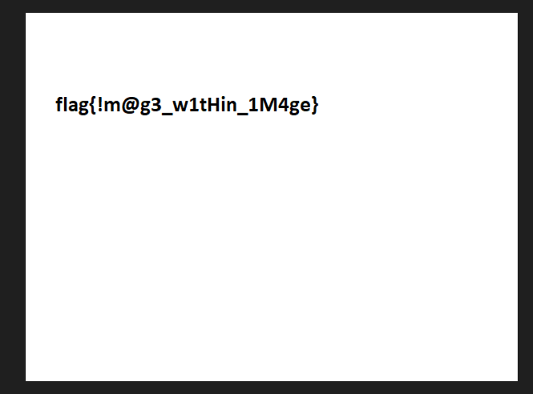
   
  

 
# Hi-Score 
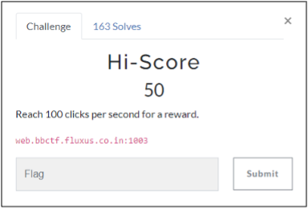
Upon navigating to the challenge URL, participants were presented with a web-based game where a “reward” (presumably, the challenge’s flag) was provided if 100 clicks in the designated area could be made per second. The webpage source code made reference to a linked JavaScript file entitled, “TheScript.js”.
The above JavaScript file was downloaded locally, and upon further review of the source code, what appeared to be a hex-obfuscated JavaScript function (function “_0x59a2()”) was observed designed to generate the game’s “reward”:

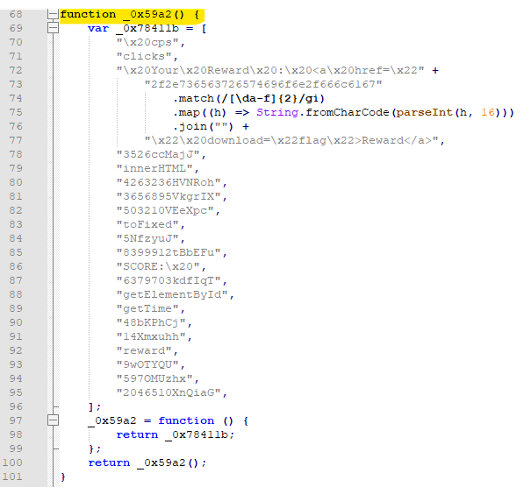
The JavaScript function was converted from hex to ASCII, revealing the flag to be located at “./secretion/flag” with the entire URL being: “http://web.bbctf.fluxus.co.in:1003/.secretion/flag”. Upon navigating to the URL, the flag was downloaded and revealed.
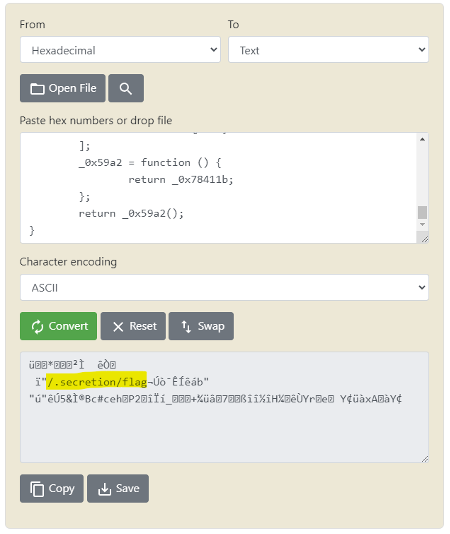
   
  

 
# Improper Error Handling 

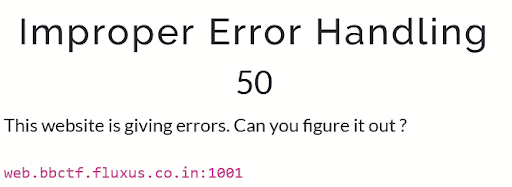

The website source code shows that the password form compares the length of the input to the length of an unknown length variable. If the two numbers are not equal, the response text will start with the word ‘error’ and an error message will appear.  If the message doesn’t begin with ‘error’ a debug message will appear.  

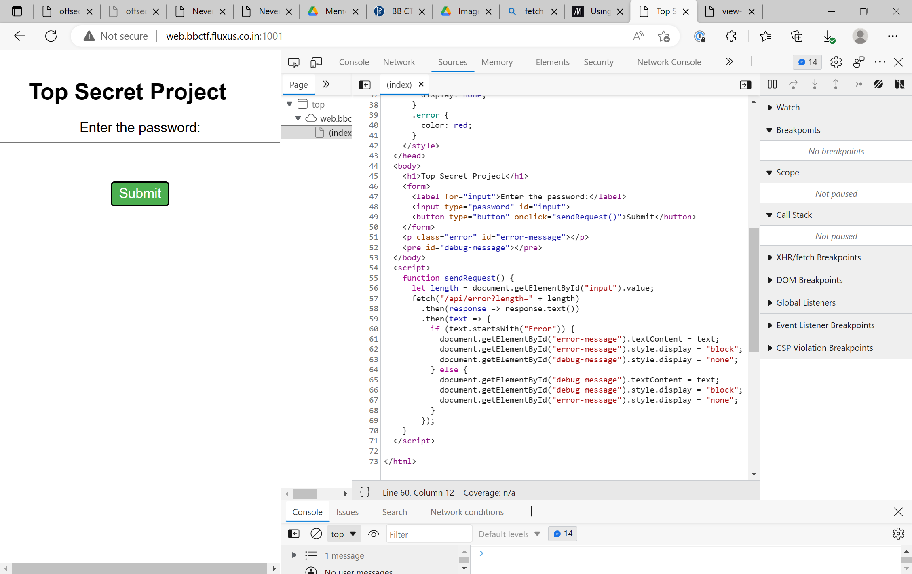

I typed in a random length password and sent the request to the repeater in burp. Different lengths gave different error messages indicating that the length was too long or too short. 

I adjusted the password length accordingly and received the flag.

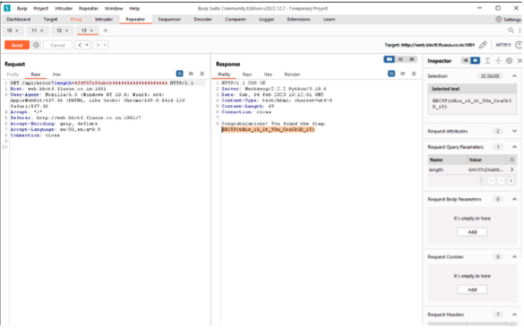

   
  

 
# Meaning of Life 

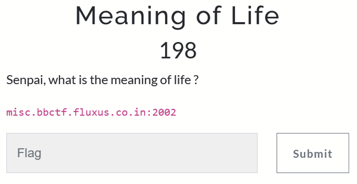
Going to this site you get a webpage where you enter a number and you get a corresponding hash value.  
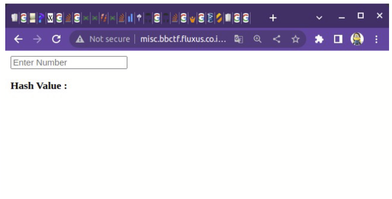
I wrote a script to retrieve the has values for numbers 1 thru 100.
~~~~
import requests
import re

API_ENDPOINT = "http://misc.bbctf.fluxus.co.in:2002"

lst = []
for i in range(1, 100):

    data = {'key_num':i}
    r = requests.post(url = API_ENDPOINT, data = data)
    reg_str = "<" + "/b" + "> (.*?) </" + "p" + ">"
    res = re.findall(reg_str, r.text)
    lst.append(res[0])
    print("{}, {}".format(i, res[0]))
~~~~
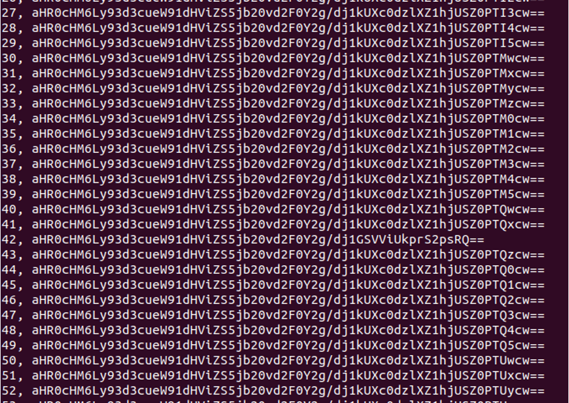
This lead to a link: https://www.youtube.com/watch?v=FIUbRJkKjlE

The youtube video played a sequence of morse code characters that needed to be converted
to letters/numbers. I translated these using a morse code cheat sheet. Took a couple of
iterations to figure it out.

~~~
dash-dot-dash-dot → C
dot-dot → I
dash-dot-dash-dot → C

dot-dot-dot-dot-dash → 4
dash-dot-dot → D
dot-dot-dot-dot-dash → 4
dot-dot-dash-dot → F
dot-dash-dot-dot → L
dot-dot → I
dot-dot-dot-dash-dash → 3
dot-dot-dot-dot-dot → 5
~~~

flag{CIC4D4FLI35}
   
  

