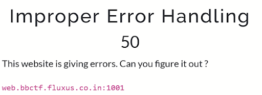

# Improper Error Handling

### Category: Web
### Point Value: 50
------

The website source code shows that the password form compares the length of the input to the length of an unknown length variable. If the two numbers are not equal, the response text will start with the word ‘error’ and an error message will appear.  If the message doesn’t begin with ‘error’ a debug message will appear.  

I typed in a random length password and sent the request to the repeater in burp. Different lengths gave different error messages indicating that the length was too long or too short. 

I adjusted the password length accordingly and received the flag.

