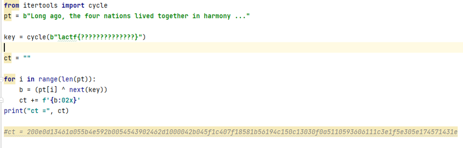
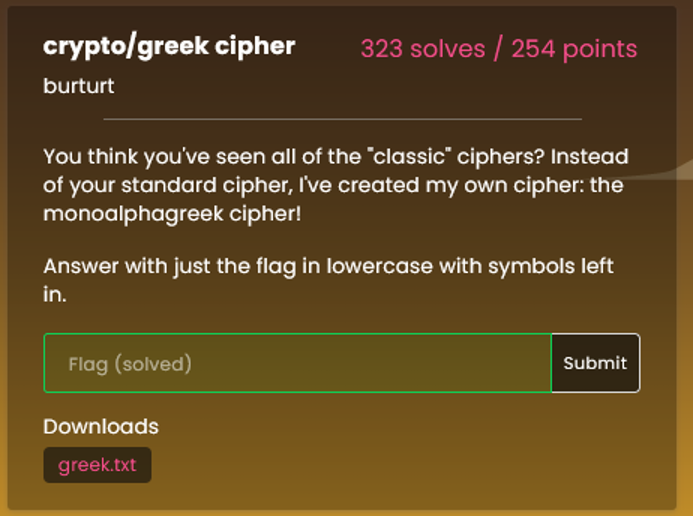

# LA CTF

### Team Name: Mandos 
-----------
 

 

 

| Members/Writeup Authors     |  |
| -----------  | ----------- |
|Diana Xu|
|Clayton Barbier|
|Eliana Halevi|
|Jen Smith|
      

## CTF Overview
The challenges were jeopardy style, and points dropped as there were more solves. Categories included Crypto, Misc, Pwn, Rev and Web. 

| Challenge Name      |  Category | Point Value |
| -----------  | ----------- | ------|
|Discord	|Misc	|10 | 
|Feedback	|Misc	|10 |
|College Tour|	Web	| 100|
|CATS!	|Misc|	107|
|string-cheese	|Rev|	112|
|gatekeep|	pwn	|138|
|one-more-time-pad	|Crypto|	154
|EBE	|Misc	|179|
|rolling in the mud	|Crypto|	183|
|caterpillar	|Rev	|200|
|greek cipher	|Crypto	|254|
|finals-simulator	|Rev	|267|
|hidden in plain sheets	|Misc|	315|
|guess-the-bit!	|Crypto	|341|
|hike to where?	|Misc	|353|
|new-challenge	|Misc	|425|
|TOTAL	|	|3148|

   
  

# string-cheese

Opened the code in ghidra and it was pretty simply to find that the flavor was blueberry

   
  

# gatekeep

Looked at the code in Ghidra, it was just a buffer overflow that would trigger going into an else block

   
  

# one-more-time-pad

A Python script was included with this challenge. 

The script includes the ciphertext and the plaintext but does not give us the complete key, which is the flag. We can XOR the ciphertext and plaintext to get the key. 

   
  

# rolling in the mud

We are given a weird png image. Since there is text after the last curly braces, I assumed the image was flipped. 

After flipping the image, I assumed the text in front of the curly braces was LACTF. Then, it was a process of replacing the symbols with the ones for LACTF, and guessing what letters mapped to what symbols.This was made easier by the challenge name and description.  
 
   
  

# EBE

RFC3514 refers to the security flag in the IPv4 header.  Used this security flag when reading the pcap file using scapy, filteried out all those packet and used that data to assemble the flag.

~~~
import sys
import re
from scapy.all import *

def main():
    val = ""
    packet = rdpcap('EBE.pcap')
    for p in packet :
        if p[IP].flags != 'evil':
           data = str(bytes(raw(p[UDP].payload)))
           print(p[IP].flags)
           val = val + data[2]
        else:
            print("not a good packet")
    print(val)

if __name__ == "__main__":
    main()

~~~

   
  

# caterpillar

Looking at the code, each on of the flag.charCodeAt was a character based on the number of  -~.  

I wrote a script to parse the file and count the number of -~ and convert to characters.

~~~
file1 = open('caterpillar.js', 'r')

catlist = []
# ignor the first line
line = file1.readline()

res = []
while True:
    # Get next line from file
    line = file1.readline()
 
    # if line is empty
    # end of file is reached
    if not line:
        break
    # parse the line and get the strlens
    test = line.strip().split("==")
    #print(len(test))

    if len(test) == 2:
        t = [0,0]
        t[0] = ''.join(c for c in test[0] if (c == '-' or c == '~'))
        t[1] = ''.join(c for c in test[1] if (c == '-' or c == '~'))
        #print(t[0])
        #print(type(t[1]))
        val = [len(t[0]), len(t[1])]
        res.append(val)

sres = sorted(res, key=lambda x: x[0])
#for m in sres :
#   print(m)

for m in sres:
    m[0] = int(m[0] / 2)
    m[1] = int(m[1] / 2)

flag = ""
for m in sres :
    flag = flag + str(chr(m[1]))
    #print(" char is " + str(chr(m[1])))

print(flag)

~~~
   
  

# Greek Cipher

This challenge provided the below text in what appeared to be Greek characters.

This challenge was resolved by performing manual character substitution via cryptii.com’s encoder-decoder Alphabetical Substitution module. Given the encoded text likely contained the flag to the challenge, we knew from previous challenges that the naming convention of the CTF flags were formatted as such: “lactf{...}”. So, in looking at the encoded text, the below highlighted Greek characters appeared to represent “lactf”.

The ciphertext alphabet field was pre-populated with the English alphabet. In starting the manual substitution exercise, we began with the “l”, “a”, “c”, “t”, “f” English characters substituted with the highlighted encoded characters, which then began to reveal certain English words:

For example, as shown above “tηat” and “cηaρactγρ” appeared to be “that” and “character” partially decoded. So, additional substitution was performed:

This exercise was repeated until the flag was then revealed:

   
  

# finals-simulator

The first was a trick that when you google it you find the answer six.

The second question was a little harder the prettiest number is the golden ratio - phi.  I forget how that mapped to 13371337 - darnit.
Third was log cabin, but the string was hidden in memory
It was just a matter of hunting around to find the final answer  it’s a log cabin!!!

   
  

# hidden in plain sheets

This was a google doc CTF where there was a hidden page.  I tried to unhide the page but that wasn’t happening.  Next i found that I could search for characters that would show up in the hidden page

I searched for { } and found that they were in the hidden sheet in rows F1..AR1.  So I assumed that there was 1 character in each column on row 1 that when put together was the flag. 

I search for every printable character and wrote down the column it was found.  After that there were still many columns that were not known. The search did not provide multiple results for each character.  But if the character wasn’t found on the first search, it wouldn’t be found in subsequent searches.  So the empty columns were duplicate characters.  It was a matter of modifying the search range to increase from A->AR and search for the chars again until all had been found.
 
 

# guess the bit!

A Python script is included in this challenge. From this, we can see that for 150 times, a random number c between n and 0 is chosen and squared. A random bit is chosen, either 0 or 1. If 1 is chosen, c is multiplied by a number a, which is 6. 

We can write a script that will guess 0 or 1 based on the following:
1.	If the number is a square, guess 0.
2.	If the number is divisible by a (6), guess 1. 
I looked for an existing python solution to detect if a number is square or not and found the gmpy2 library has an is_square function (https://gmpy2.readthedocs.io/en/latest/mpz.html). The resulting script I wrote is:

~~~
#!/usr/bin/env python3
from pwn import *
import gmpy2

def repeat():
   round = 1
   #set up socket
   s = remote("lac.tf", 31190)

   loop = True
   s.recvuntil(b'n =  ')
   n = int(s.recvuntil(b'\n'))
   s.recvuntil(b'a =  ')
   a = int(s.recvuntil(b"\n"))
   while(loop):
       print(round) #prints each round
       s.recvuntil(b'c =  ')
       c = int(s.recvuntil(b"\n"))
       s.recvuntil(b"What is your guess? ")
       #print(n,"\n", a,"\n", c,"\n")
       if (gmpy2.is_square(c)): #if is square, send 0
           s.send(b'0\n')
       elif(c % a == 0): #if divisible by 6, send 1
           s.send(b'1\n')
       else:
           s.send(b'0\n')

       if(round == 150): #if final round, output lines and exit loop
           i = s.recvuntil(b"\n")
           j = s.recvuntil(b"\n")
           print(i, j)
           loop = False
          
       round += 1

repeat()

~~~

After running the script, we get the flag:

   
  

 # hike to where?
 
 The picture here is the image given in the prompt. 
 
 The metadata contained no additional information so I ran a reverse image search. Again, the information presented in the results was minimal at best. 

 Instead, I ran a facial recognition search with pimeyes. One result included a potentially useful url, or at least part of a url: careynachenberg.we
 

 A search for “careynachenberg.we” showed that we’re on the right track! Carey Nachenberg is a computer science professor at UCLA!

 His facebook gave no information nor did his personal page; Nachenberg is an avid hiker and none of his posts included the picture in question nor was he wearing the same shirt. The original image gave an additional clue: this hike was not organized by him. A new search for “Carey Nachenberg hike” shows that he participated in a hike to Skull Rock with UCLA.  Promising, but not definitive. I needed images from the hike. 

 A few results down on the google pages took me to this picture:

 Same shirt, same glasses, on a hike he didn’t organize. As a bonus, the name “skull rock” fits neatly into the example given for the flag format in the prompt; the flag was lactf{skull_rock}.

   
  

# new-challenge

The objective of this challenge was to perform a successful Git “push” to a remote repository, which would presumably return the challenge’s flag.

We started with “cloning” the repository locally and enumerating files that the repository contained. 

One particular file of interest was a shell script named “pre-receive”. Upon further review of the script, it appeared that access to the remote Git repository was limited to only CTF challenge writers, where the writer identified as Benson Liu was configured with “commit” access (i.e., “HAS_BLIUTECH_COMMIT=true”):

We then executed “git commit” in the main directory of the cloned repository, which required us to first configure our identity. Knowing that commit access appeared to be assigned to Benson Liu, we used this information in configuring our Git user and email variables:

While attempting to commit and push to the remote repository, we had to first add a description. A file named “description” was created, committed, and subsequently “pushed” to the remote repository, which returned the challenge’s flag:
