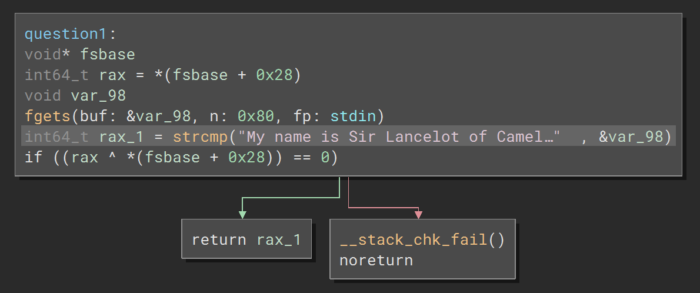

# Bridge of Death

### Category: Rev
__________________________

Because this challenge is a revere engineering problem, I began by opening the given file with Binary Ninja and examined the code. 

This challenge consists of three questions. Each question must be answered correctly to make it to the "win" condition, "print_flag()"

The first question must return a value not equal to 0. 

in this question, the return value is the result of the comparison between a given input string and the string the program wants. If the two are the same rax_1 will equal 1.  

The full string required to ride past quesiton 1 is:

~~~
"My name is Sir Lancelot of Camelot."
~~~

Next, quesiton 2 asks what the user's quest is. To make it to quesiton 3 the return value of question 2 must equal 0. So waht is the quest? Is it to slay a dragon? Make a daring rescue? No! It wants a number.

Quesiton 2 takes in a number and compares it to the result of a function call. If the numbers are the same the return value is zero. Essentially, the return value of the call should be the given number from the user. 

At a glance, func2 looks messy, but closer look reveals that, with the given inputs, rax_1 is equal to 20. 

rax_1 bit shifted right by a value greater than 20 is zero. rax_5 is just rax_1 bit shifted by one to the right, is 1010 and is equal to 10.
If the user input is equal to rax_5, the return value will be the user input and the messy larger functions can be avoided entirely. 

Finally, question 3 must be equal to 0. 

In this function, to return 0, the program enters the while loop and takes in two numbers, each under 256. 

Simply put, there are 9 numbers (1 through 9) stored in the forestofEwing and the comparison statement checks if that number is in that memory location. The memory location is found by adding the forrest entrance location to rax_5 and a bit shifted rax_3. When all numbers are found, the program breaks out of the loop and 0 will be returned. I found all the numbers and wrote a script that calculated the values of rax_3 and rax_5. 

