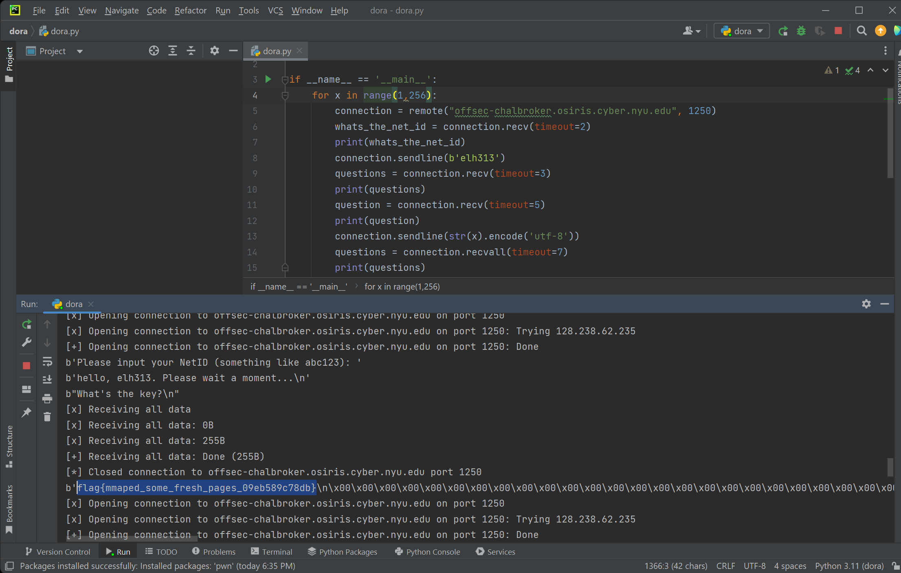

# Dora

### Category: Rev
__________________________

Because this challenge is a revere engineering problem, I began by opening the given file with Binary Ninja and examined the code. 

In Binary Ninja, it is clear that the program takes in a number, checks if it is in a certain range, then performs operations using that number. 

The "win" scenario is to run rax_1(). At a glace, the first comparison of rax_4 seems important, but the only impact passing or failling will have is on the value of rax_5, and rax_5 is only used as a return value! Therefore, we can safely and confidently ignore: 

~~~
if (rax_4 s< 0 || (rax_4 s>= 0 && rax_4 s> 0xff))
~~~

Moving on, to reach the "win" condition, we must first enter the while loop. To enter the while loop rax_4 must be a number from 0 to 255. Since this is the *only* user input and [0,255] is a small range, we can simply ignore the rest of the commands and create a brute force script that tries every number from 0 to 255! Easy.

