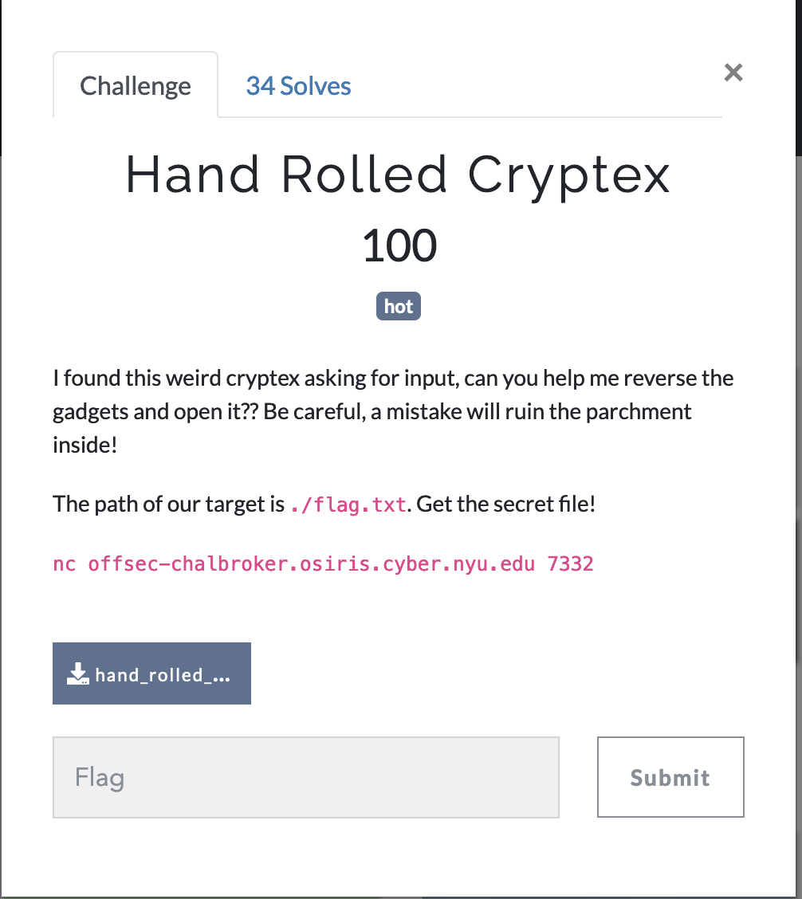
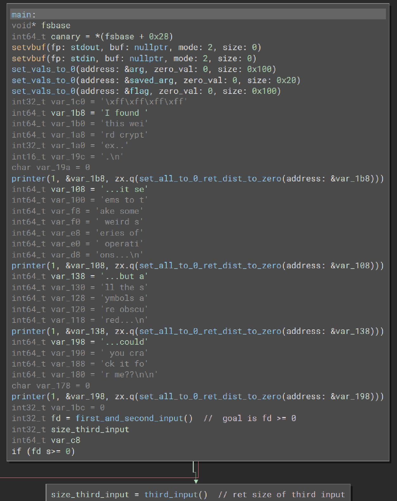
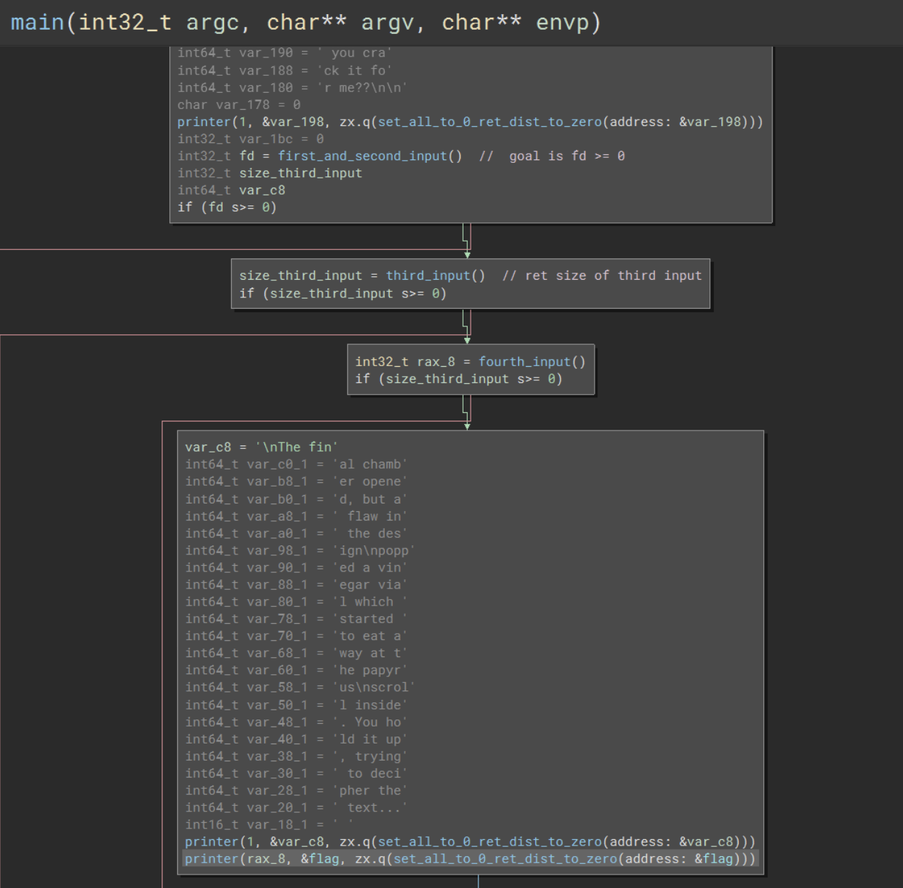
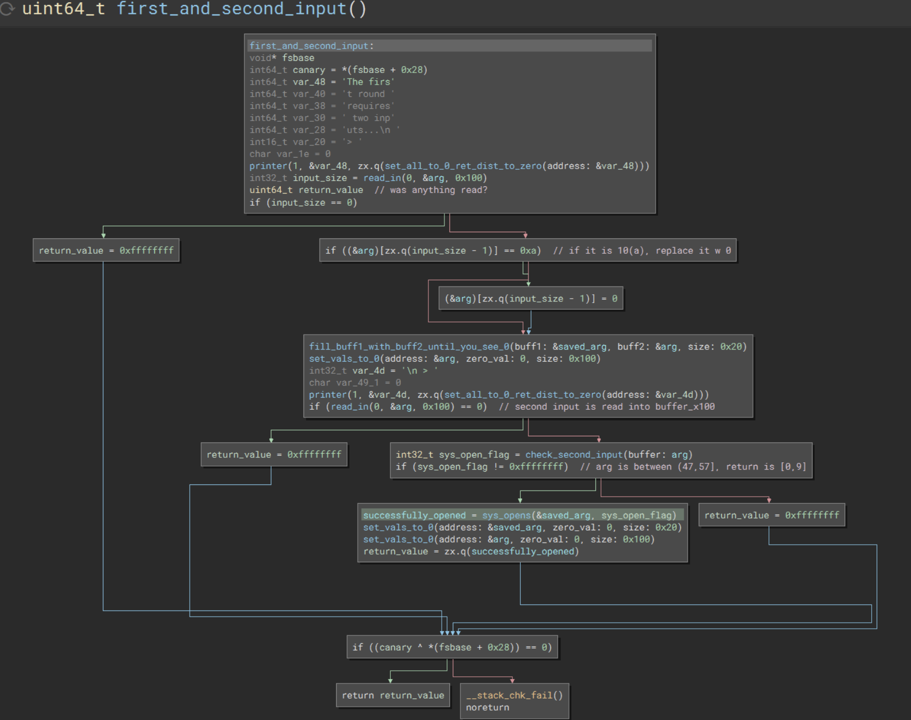
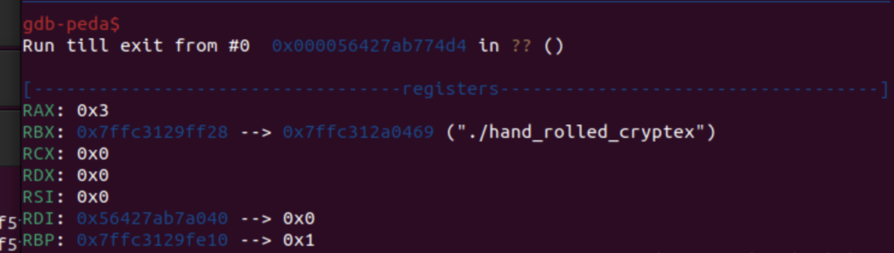
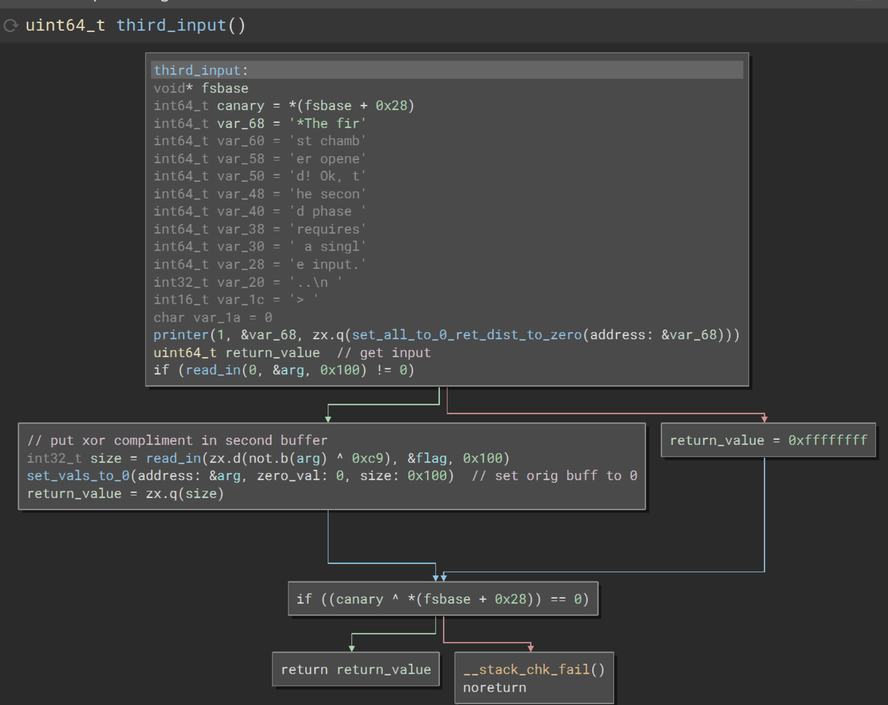
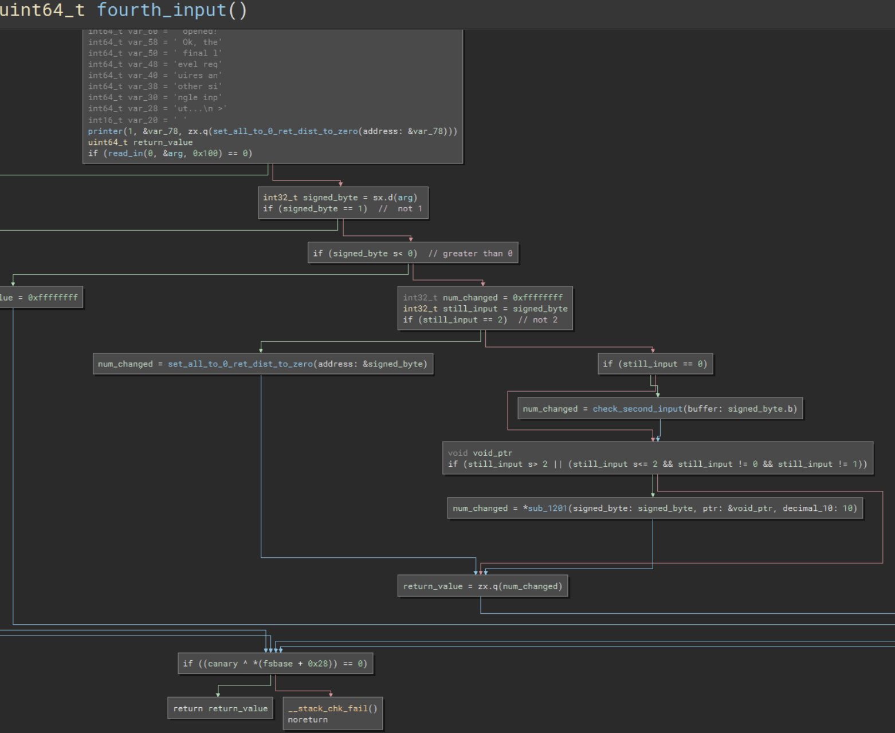
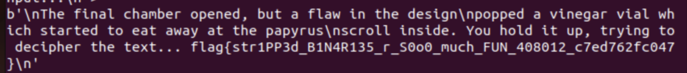

# Hand Rolled Cryptex

### Category: Rev
__________________________

Because this challenge is a reverse engineering problem, I began by opening the given file with Binary Ninja and examined the code. 

Due to the nature of decompilation, the output here is a bit chaotic. To make things more readable I went line-by-line through the code to change the names automatically generated into something more comprehensible. I also noted the values needed at each juncture to access different branches as well as the operations that each step performed. 

Although it may appear daunting, the first few operations allocate memory and set the values stored therein to 0. The large blocks of bytes that follow are actually text and the operations right after each block prints everything in a certain area of memory until it encounters the character 0. 

In that entire first block, the only part that really matters for our purposes is the function I titled "first_and_second_input".

In this function, an input that will be used as a file name is read in. If the last byte read in is equal to 0xa the value is replaced with 0. To open the file successfully, the sys_open command takes the file name and the file descriptor to open a file (char 0, equal to \x30). We know the file name is 'flag.txt' so the first input is b'flag.txt\xa' and the second input is b'0'.
If the file is successfully opened, the zero extended value of the file descriptor is returned. Once opened, the file descriptor is actually 3 (shown below). The first chamber opens!

Following the logic, the file descriptor value, 3, is larger than 0x0 so we proceed to the block containing "size_of_third_input" and enter the third_input() function. 

In this function, the compliment of the input is XOR-ed with 0xc9 and passed into the read_in function as a file descriptor. From the last chamber, we know that the open file has a file descriptor of 3, seen here in RAX.

~~~
(~input) ^ 0xc9 = 3
~~~

 We enter b'5' or b'\x35' and the next chamber opens!

 Finally, we enter the last chamber. In this chamber, a number is taken in from the user and if it is equal to 2, and area of memory is cleared and the number of bytes changed to 0 is returned. In this case, the number returned would be 1. 

 >Note: in the main function, this return value is later used in a function that prints. To print successfully, the number returned must be 1. 

 We could continue on to see what happens if the input is greater than or equal to 0—and, silly me, I did!—but you don't need to! If you test the value \x02, the flag prints! 

 ~~~
print(b'flag.txt\x0a')
connection.send(b'flag.txt\x0a')
reply = connection.recv(timeout=3)
print(reply)
print(b'0')
connection.send(b'0')
reply = connection.recv(timeout=3)
print(reply)
print(b'5')
connection.send(b'5')
reply = connection.recv(timeout=3)
print(reply)
connection.send(b'\x02')
reply = connection.recv(timeout=3)
print(reply)
reply = connection.recv(timeout=3)
print(reply)
 ~~~

 

 > If you must know, it appears to be a wild function that writes new information (aka gibberish) then reverses the order of the information.