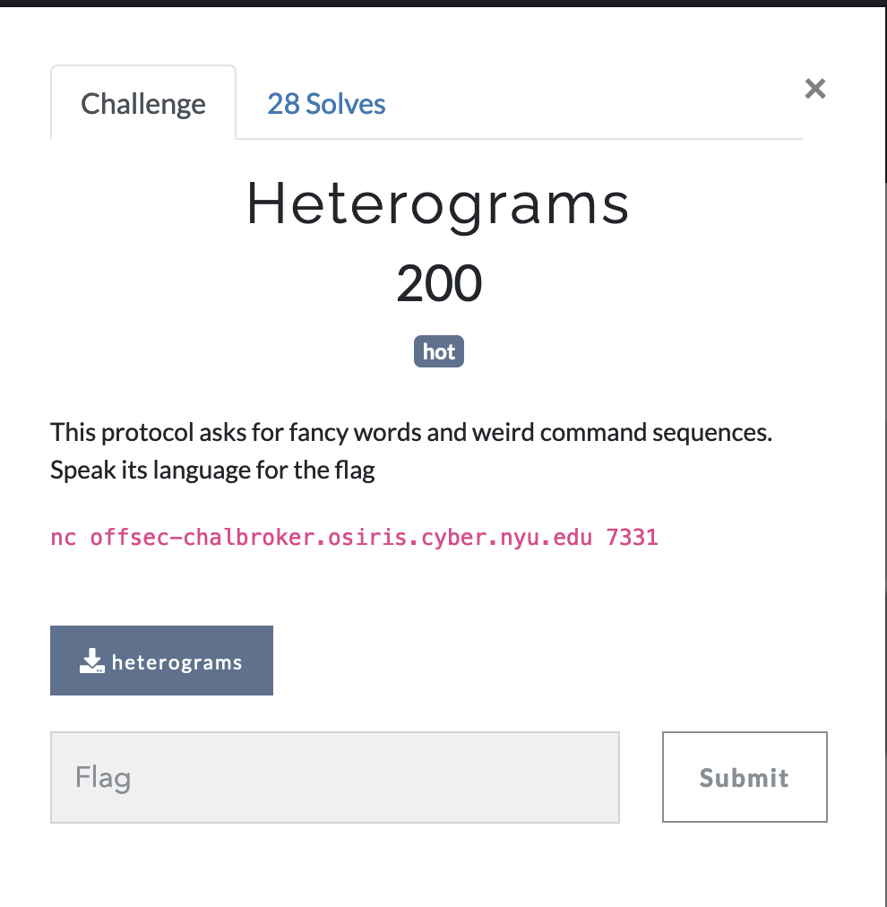
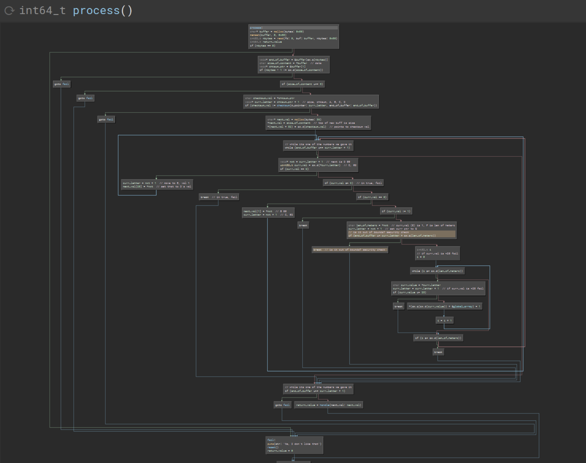
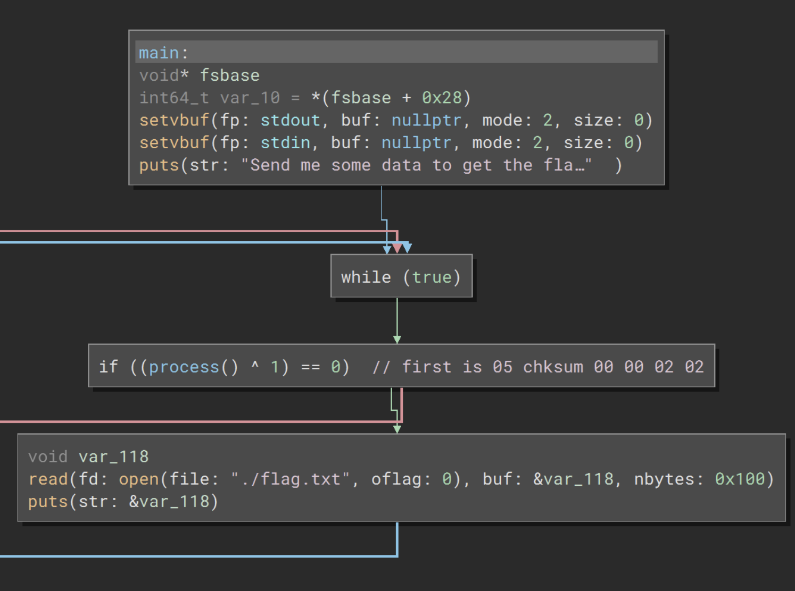
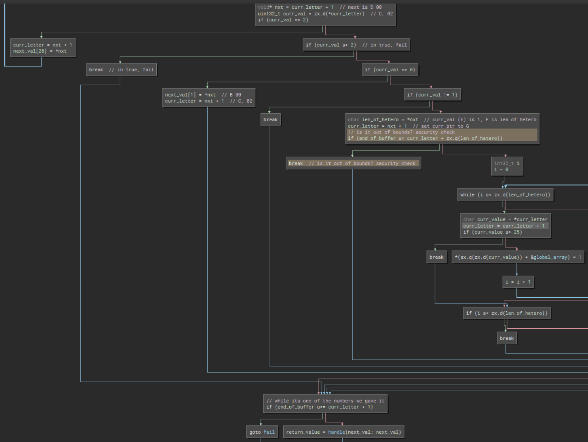
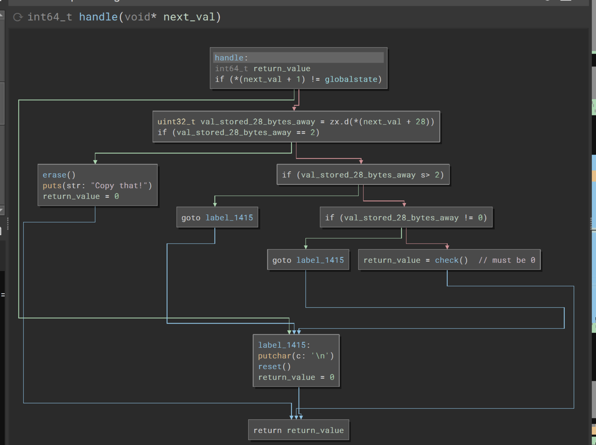
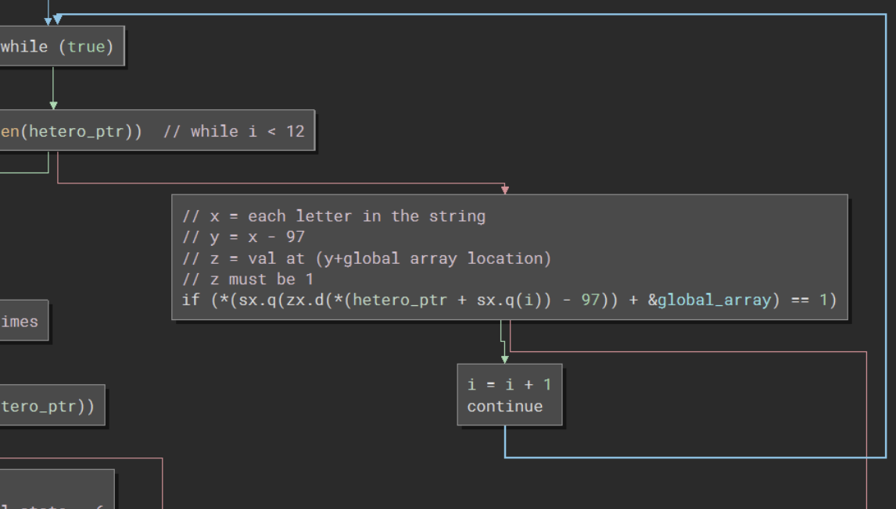
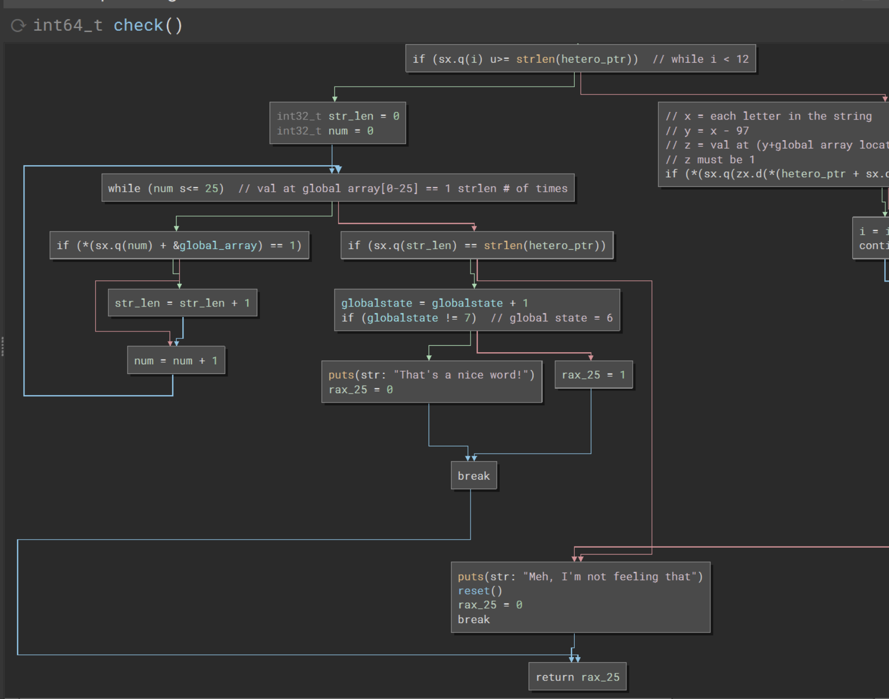
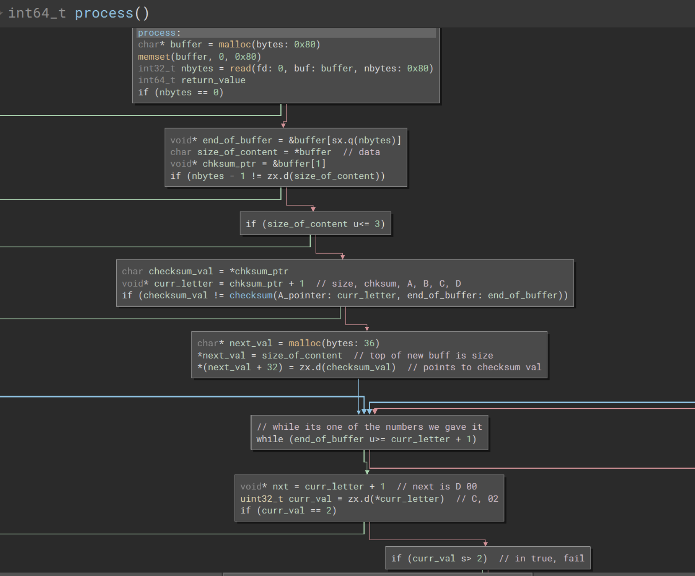
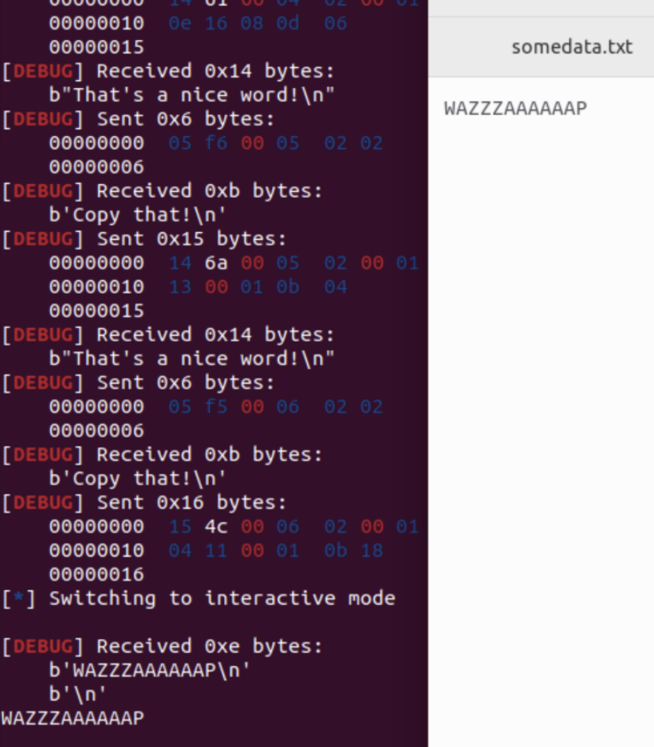
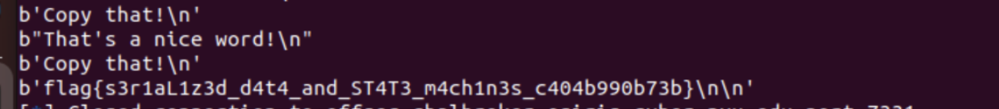

# Heterograms

### Category: Rev
__________________________

This one is a doozy, so strap in!

As usual, because this challenge is a reverse engineering problem, I began by opening the given file with Binary Ninja and examined the code. 

Due to the nature of decompilation, the output here is a bit chaotic. To make things more readable I went line-by-line through the code to change the names automatically generated into something more comprehensible. I also noted the values needed at each juncture to access different branches as well as the operations that each step performed. 

The main() function shows that the "win" condition can only be reached if the return value from process is 1. On its face it seems simple enough! So how do we get proccess to return 1? 

The process funciton, internally, is a monster of branching statements. It's difficult but we need to ignore most of what's going on and look only at the return values. There is only one line that could potentially return 1:

~~~
return_value = handle(next_val)
~~~

What conditions need to occur within handle to return 1? What is happening inside of handle()? 

In handle(), you can either lose your progress via reset(), erase the values in global_array by replacing each value with 0, or you can enter check(). 

Facts:
1. If you don't want to lose your progress, the value stored at next_val[1] must be equal to the global state.
2. To erase the values stored in global_array, the value stored at next_val[28] must equal 2. 
3. Erasing and restarting do not return 1. To return 1 we must enter check() at least once.
4. To enter check(), the value stored at next_val[28] must be 0.

Well. Roll up your sleeves, let's examine the inner working of check()!

Inside of check() we are given a new pointer. The location of this pointer is calculated with the following equation: 

~~~
(globalstate_value << 4 )- globalstate_value + "unforgivable"
~~~

In this instance, "unforgivable" is the location of the first heterogram stored in the binary! Every time the globalstate_value increases, the pointer moves to the next heterogram string!

Now, once that's established, the length of the heterogram string in question is taken and you enter the a while loop. In the while loop, you iterate through each charater in the string and get x, the difference between the character's value and 97. If the value at global_array[x] is 1, you're good. If not, you enter failure and return 0. If global_array[x] is 1 for every value of x, then move to the next while loop. 

Essentially, the next while loop counts the number of 1s in the global array. If the number of ones is unequal to the length of the string, the global_array does not represent the string in question and you get a failure. This indicates that between heterograms we must erase the globalarray! If it is the same and globalstate + 1 != 7, the globalstate incriments by one and you return zero. If it is equal to 7 you return 1!

Returning zero may seem like a failure at first, but it isnt! Once zero is returned by check() and handle() and process(), the binary continues along the while loop in main, but this time the value of the globalstate has increased! To increase the globalstate again the user must erase the global array, then check the next heterogram. 

It's exhausting, but we're not done! We still haven't entered any inputs! What conditions must be met to enter check() and handle()?

To pass check:
- The value stored at next_val[1] must be equal to the global state.
- The value stored at next_val[28] must be 0.
- The values at global_array[x] must be 1
- The value of x is calculated by subtracting 97 from the value of each charater in the heterogram string in question. 

To pass handle:
- The value stored at next_val[1] must be equal to the global state.
- The value stored at next_val[28] must be 2.

Clear as mud, right?

From here, we need to return to proccess, to see how we can set the values at next_val[1] and next_val[28]]. Back to proccess()!

In process(), to go anywhere, the first byte value given, (which is equal to the length of the rest of the data) must be greater than or equal to 4. Going forward we know that any input given will have a minimum of 5 bytes. 

The binary then looks at the next value and checks to see if the value of the next byte is equal to the compliment of the sum of the rest of the bytes given. Here, this value is refered to as the checksum.

Lets visualize the input like so:

|SIZE | Checksum |A |B |C |D |E|
|--|--|--|--|--|-- |--|
| | | | ||  | |

The program then creates a new structure, the next_val structure, like so:

| location| value  |
|--|--|
|0 | SIZE |
| .. | .. |
|.. | .. |
|.. | .. |
|32| Checksum|
|.. | .. |
|..|..|

The binary then looks at what we will now call A. We know that we will need to change the value of next_val[1]. To get there, the current value must be 0 and the next value, B must be equal to the globalstate. Which would make:

|SIZE | Checksum |00 |Globalstate |C |D |E|
|--|--|--|--|--|-- |--|
| | | | ||  | |
 

| location| value  |
|--|--|
|0 | SIZE |
| 1 | globalstate |
|.. | .. |
|.. | .. |
|32| Checksum|
|.. | .. |
|..|..|

After setting this value we return to the top of the while loop. There is only one way to change the value of next_val[28] and that is if the current value is equal to 2. Based on previous examination, we know the value being store must be 2 if we want to erase and 0 if we want to go to check(). 

|SIZE | Checksum |00 |Globalstate | 00 | 00 OR 02 |E|
|--|--|--|--|--|-- |--|
| | | | ||  | |
 

| location| value  |
|--|--|
|0 | SIZE |
| 1 | globalstate |
|.. | .. |
|28 | 00 or 02 |
|.. | .. |
|32| Checksum|
|.. | .. |
|..|..|

We return to the top of the while loop. Now, we must alter the values in the global array. To reach the next while loop, the current value must be equal to 1 and the next byte is equal to len(hetero) because we're altering len(hetero) bytes so we must loop through this while loop len(hetero) times! The final bytes will therefore be the values of the bytes of the heterograms minus 97.

Have I lost you yet?
No? Yes? Good? Sorry?

|SIZE | Checksum |00 |Globalstate | 00 | 00 OR 02 |1| Len(hetero)| BYTES OF HETERO -97 |
|--|--|--|--|--|--|--|--| --|
|  |  |  |  |  |  |  |  |   |
 

| location| value  |
|--|--|
|0 | SIZE |
| 1 | globalstate |
|.. | .. |
|28 | 00 or 02 |
|.. | .. |
|32| Checksum|
|.. | .. |
|..|..|

As previously established, we want to erase(), check(), and repeat. There are 7 heterograms. Put it all together and....

~~~
def checksum(pay):
    s=0
    for x in pay:
        s += x
    return ((~s)%0x100)

def wrapper(pay):
    return p8(len(pay)+1)+p8(checksum(pay))+pay

hetero = ['unforgivable', 'troublemakings', 'computerizably', 'hydromagnetics', 'flamethrowing', 'copyrightable', 'undiscoverably']

hex_num = [b'\0\0\2\2']
pay = ''
count = 0

for x in hetero:
    this_count = int.to_bytes(count, 1, byteorder='little')
    hetero_leng = int.to_bytes(len(x), 1, byteorder='little')
    payload = b''
    for letter in x:
        num = (ord(letter)-97)
        payload += int.to_bytes(num, 1, byteorder='little')
    pay = b'\x00' + this_count + b'\x02\x00\x01' + hetero_leng + payload
    hex_num.append(pay)
    count += 1

~~~
Try it locally:

And With the server:

Voilá! Flag!