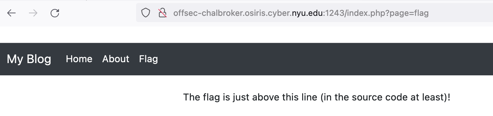
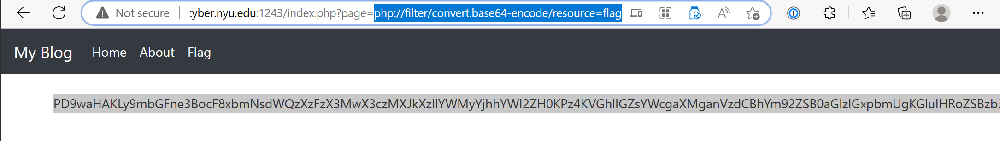
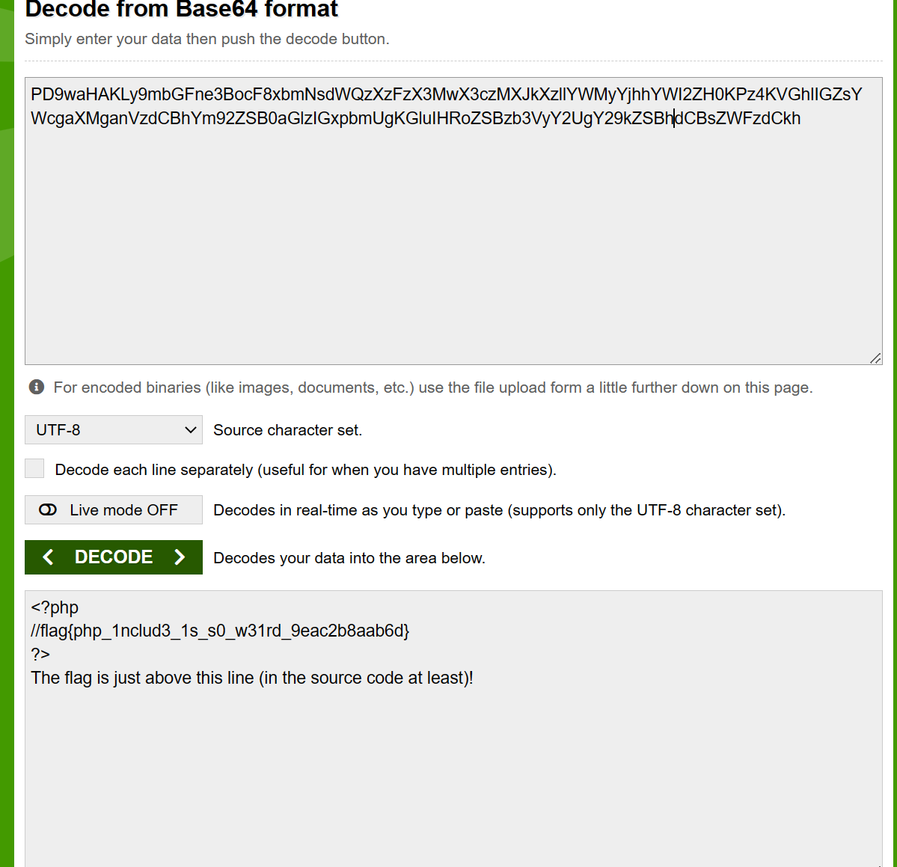

# Inclusion

### Category: Web
__________________________

Based on the name I knew this would involve file inclusion. Clicking through the pages I saw that
the sites used php. One page that used php was called flag and claimed to have the flag in it’s
source code. 

I used the folowing payload in the URL:

~~~
php://filter/convert.base64-encode/resource=flag
~~~

As a result the page displayed a base64-encoded string. I decoded the string and
retrieved the flag!

