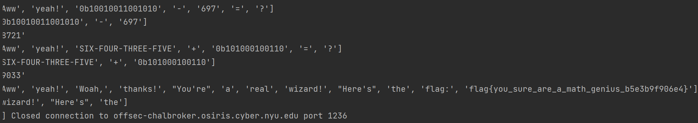

# Mathwhiz

### Category: Programming
__________________________

I connected to the remote server and was prompted with basic math problems adding and subtracting integers. I created a script to connect to the server and solve the math problems given. I assumed that only the first few problems would be addition or subtraction and that it may progress to multiplication, division and modulo. 

My script reads in the reply to the connection initiation, sends my id, reads in the problem, cleans the numbers by converting the given string of base ten numbers into type int and uses if statements to determine which operator to use (based on the value of the string between the two numbers). 

When reading in the reply, it was apparent that the part that included the math questions was at the end of the reply. Upon recieving a new reply from the server I decoded the reply, split it, and examined each number and operator individually.

### Excerpt from main
~~~
    question = leggo.recv(timeout=3).decode('utf-8').split()
    math_parts = question[-5:-2]
    answer = mathymath(math_parts[0], math_parts[1], math_parts[2]).encode()
    leggo.sendline(answer)
~~~

Originally, 'cleaning' the numbers given only meant converting the string to type int, (ex. '77' -> 77).

~~~
def mathymath(number1: str, operator: str, number2) -> str:
    num1 = clean_numbers(number1)
    num2 = clean_numbers(number2)
    result = ''
    if operator == '*':
        result = num1 * num2
    elif operator == '+':
        result = num1 + num2
    elif operator == '-':
        result = num1 - num2
    elif operator == '/':
        result = num1 / num2
    elif operator == '%':
        result = num1 % num2
    return str(result)
~~~

This worked well until the numbers were presented in a different format. Numbers were later given in hexadecimal, binary, and even as words. 

For example:
- 1
- 0xde
- 0b0101
- four-two-three-seven

Whenever a new number format appeared I determined how to convert it to base ten and then proceeded as I did before. 

The code I used was fairly clunky but it did the job.
~~~
def clean_numbers(number: str) -> int:
    if number[:2] == '0b':
        return int(number[2:], 2)
    try:
        good_number = int(number)
        return good_number
    except ValueError:
        pass
    try:
        numbers = number.lower().split('-')
        good_number = ''
        for num in numbers:
            if num == 'zero':
                good_number += '0'
            elif num == 'one':
                good_number += '1'
            elif num == 'two':
                good_number += '2'
            elif num == 'three':
                good_number += '3'
            elif num == 'four':
                good_number += '4'
            elif num == 'five':
                good_number += '5'
            elif num == 'six':
                good_number += '6'
            elif num == 'seven':
                good_number += '7'
            elif num == 'eight':
                good_number += '8'
            elif num == 'nine':
                good_number += '9'
        return int(good_number)
    except ValueError:
        pass
    try:
        good_number = int(number, 16)
        return good_number
    except ValueError:
        pass
    finally:
        return int(good_number)
~~~

When the server ran out of equations it offered me a flag!

