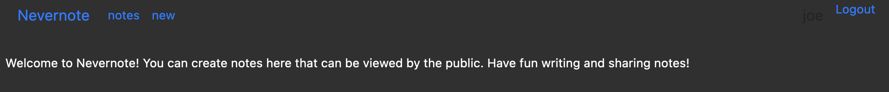
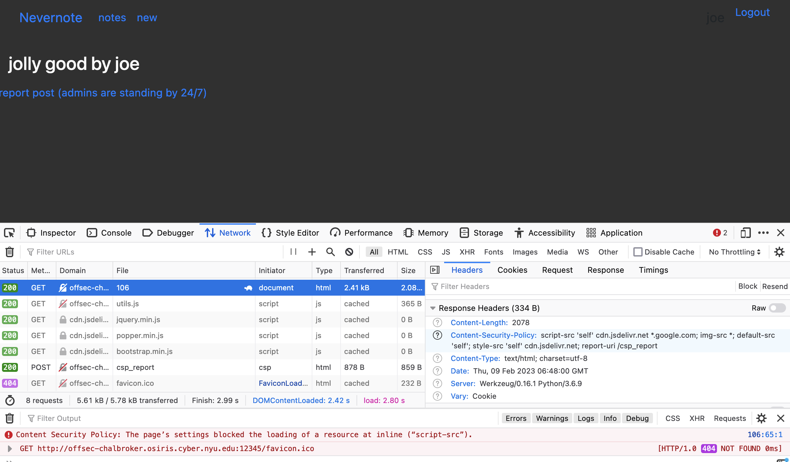
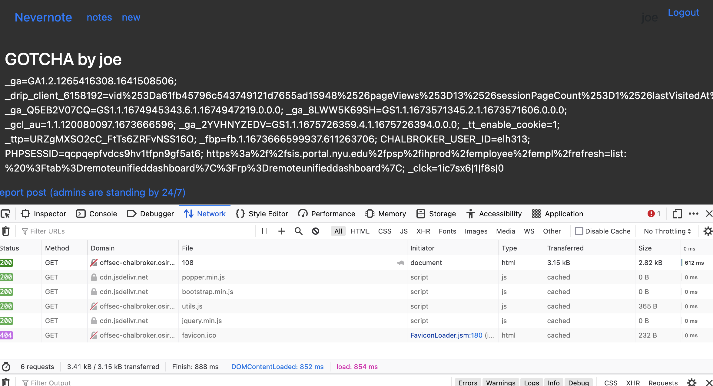
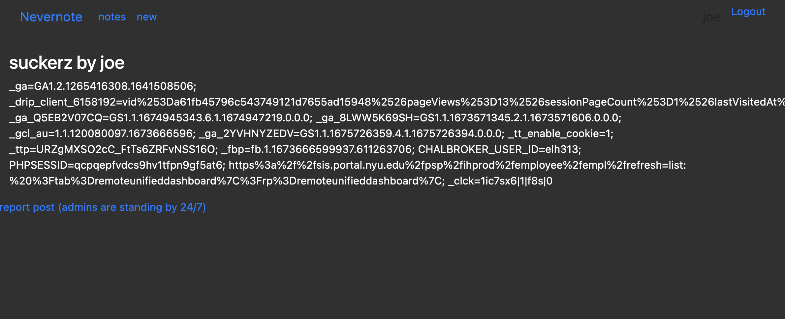
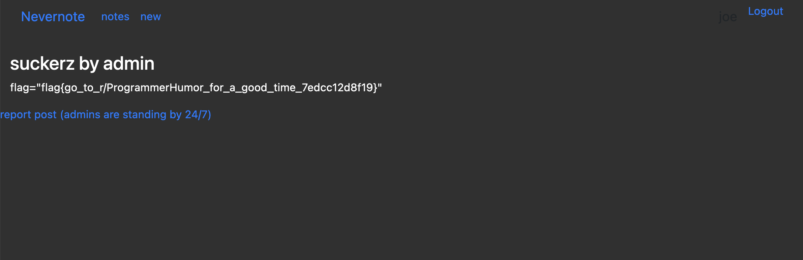

# Nevernote CSP

### Category: Web
__________________________

Given that the challenge prompt says that the cookie is in the admin's flag, is stands to reason that I'll need to create a note that instantly causes a user to post their cookies.

To start, I used command line injection to test what was allowed in the note content. 

~~~

~~~
gave the following error:

The content security policy (CSP) didn’t allow for inline script from an unknown source, but asp per the CSP rules in the response header, sites like `accounts.google.com` are fair game. This means I could use a callback. Callbacks are essentially functions used as arguments in other functions. By using another function from a trusted website to call our evil function, we effectively bypass the CSP! I crafted the following input:

~~~

~~~
Infuriatingly, this both worked and didn’t work. For all intents and purposes, I achieved my goal: users that see the note involuntarily post their cookie information for all to see, unfortunately, this worked on every account except for the admin! 

>After some digging, it appears that many sites don’t automatically allow admins to run ajax! Who knew?

Finally, a slightly simpler line of code did the trick. 
~~~

~~~

Instead of ajax, I used post, reported the note, and retrieved the flag.

