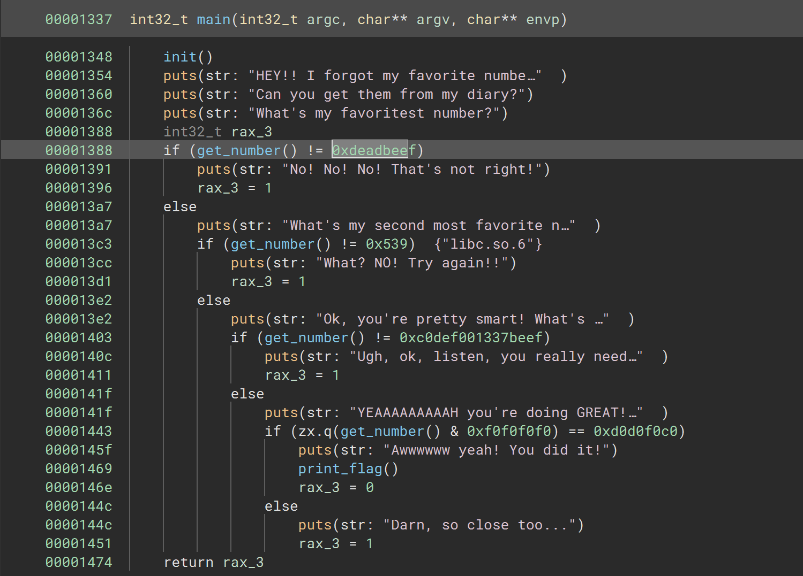

# Numerix

### Category: Rev
__________________________

 
Because this challenge is a revere engineering problem, I began by opening the given file with Binary Ninja and examined the code. 

According to the code, the user enters a number, that number is compared to a constant, and then and the process repeats with new numbers until all numbers are correctly guessed. A closer look at get_number() showed that all numbers given by the user must be in base 10 to be read (as indicated by base:0xa). 

I converted 0xdeadbeef to decimal, submitted it as the "favoritest number" and was awarded with the next prompt. I repeated this with ox539 and 0xc0def00l337beef. The last number however was slightly different.

~~~
zx.q(get_number() & 0xf0f0f0f0) == 0xd0d0f0c0
~~~

In plain English, the user input is retrieved and bit-wise and is used between the input and 0xf0f0f0f0. The result of that operation is then zero-extended to an 8 byte number. If the final number is equivalent to 0xd0d0f0c0, then the flag will be printed. 

Interestingly, with bit-wise and, the final number compared against either of the two original numbers would still result in the original final number!

If A & B = C, then:
- A & C = C
- B & C = C
- C & C = C

In other words: a user input that would result in 0xd0d0f0c0 would be 0xd0d0f0c0! I entered the decimal value of 0xd0d0f0c0 and recieved the flag!

