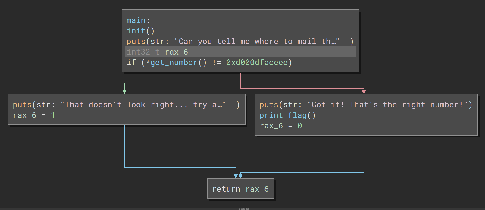
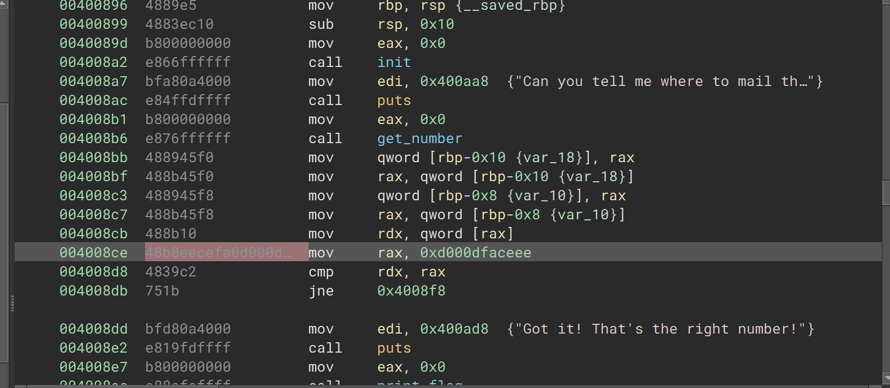
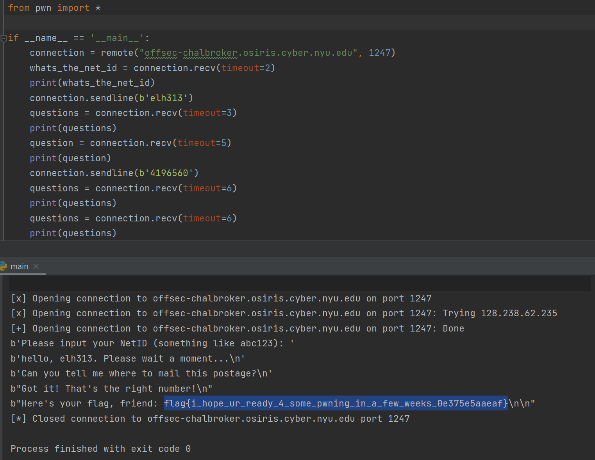

# Postage

### Category: Rev
__________________________

Because this challenge is a revere engineering problem, I began by opening the given file with Binary Ninja and examined the code. 

Like with Numerix, a user enters a number in base 10, and a number is compared to a constant, but unlike Numerix, the number being compared to the constant (0xd000dfaceee) is not the user input! In this challenge, the get_number function is a pointer! Instead of comparing the return value to the constant, the code treats the return value as an address and compares the value stored at that address to the constant!
The only instance of 0xd000dfaceee stored in the program is in rax!
Looking at the disassembled code, we can see that 0xd000dfaceee is stored at 004008ce. 

Unfortunetly, if you call this number, you'll also get the 48b8 thats also in that location! 

To bypass those two bytes call the address two bytes over! 004008ce becomes 004008d0 which in turn is 4196560 in decimal. Call 4196560 and retrieve the flag!

