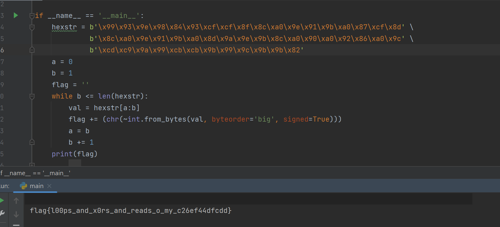

# Strops

### Category: Rev
__________________________

Because this challenge is a revere engineering problem, I began by opening the given file with Binary Ninja and examined the code. 

Unlike other challenges, the binary is not hosted on an external server; Everything (including the flag) is in the code I have. The flag itself is actually located in the program at 0x00004020. Sadly, operations need to be run to get the flag to its final form because in base64 it's mZOemISTz8+PjKCekZugh8+NjKCekZugjZqem4ygkKCShqCczcmamcvLm5mcm5uC

According to the logic, the user supplies the binary with a number, var_5c is set to zero, and then the program enters a while loop. Since var_5c is less than 48 so we move to the 'if' statement.

Although the statement appears messy, all it's really asking for is this: 

Starting at 0x00004020, iterate through the next 47 bytes and get the signed two's compliment of value. The resulting numbers are the characters which comprise the flag.  

I wrote a script to obtain the 2's complment and print the resulting string. 
